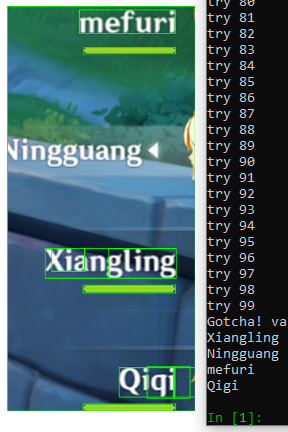

# genshingrab

A python script to specifically scrape text data shown on the HUD of Genshin Impact.

------

**genshingrab** is inspired from [Kxnrl](https://github.com/Kxnrl)'s [GenshinDiscordRpc](https://github.com/Kxnrl/GenshinDiscordRpc) github [issue](https://github.com/Kxnrl/GenshinDiscordRpc/issues/3) where the issue starter and the dev said, quoting them:

> [ScarVite](https://github.com/ScarVite):<br/>
You could implement this using the small image and for hover text the level<br/>
Every Char could have a Different Image, which represents the character, just as FF XIV is doing it

> [Kxnrl](https://github.com/Kxnrl):<br/>
No, we can not access game process memory.<br/>
This is an external tool.

[Kxnrl](https://github.com/Kxnrl) further says it is possible, but it also increases the possibility the game anticheat (presumably the `mhyprot2.sys`) will trigger. Henceforth, I think would be good if I try to give them a temporary solution for him.

If you wanted to try:

1. Clone this repository to your local system which you used to run Genshin Impact
2. Install the required dependencies (listed in [Dependencies](#Dependencies) section)
3. Run Genshin Impact in full screen mode
4. Go back to desktop and run this using elevated (run as administrator) Command Prompt in the project folder **everytime** you want to get your roster/party setup names:
    - If using only required dependencies:
        ```cmd
        python grab.py
        ```
    - Or if you also install all the optional dependencies:
        ```cmd
        ipython --no-banner grab.py
        ```
5. Quickly switch into Genshin Impact again within 1 second after the code started
6. Keep playing
7. When it's done, you will be automatically alt+tabbed to see the last screenshot. The roster names will be shown on Command Prompt that you used to run the code.

## Current limitations

For now, genshingrab:
 
- only supports to read the roster/party setup.
- current iteration is takes assumption that Genshin Impact is running in full screen mode
- only works for Windows version of Genshin Impact, and there's no plan to support other platforms.
- program must be run manually every time you want to get roster/party setup, and you have to quickly alt+tab to the game within 1 second after running the program
- probably will not run smoothly in low-end computers **while playing Genshin Impact** due to the complexity of the algorithm

Some of the explanations regarding these limitations will be put in the [Disclaimer](#Disclaimer) section.

## How it works

**For now, genshingrab  In addition, only works for Windows version of Genshin Impact.**



genshingrab _(in the current design plan)_ works by screenshotting the game every 5 minutes (though in the current commit, it only run once.), in which every time it triggers (which will be refered as 'the periodic refresh'), will screenshot the game for 20-100 times in really short interval possible between screenshots.

Those screenshotted images on a periodic refresh will be passed into an Optical Character Recognition (OCR) algorithm to be scanned for texts. Each scanned texts from each screenshots will be merged into one long array, and then counted. The top four of the names with highest frequencies are the valid roster names. The pseudocode looked like this:

```pseudocode
every 5 minutes:

    screenshot_list = []
    ocr_data_list = []
    name_list = []

    execute this from 20 up to 100 times:

        take screenshot from game then put it to screenshot_list
        generate ocr_data from every screenshot in screenshot_list then put it to ocr_data_list
        filter name from every ocr_data in ocr_data_list then put it to name_list

    unique = []
    counts = []

    put all the unique name from name_list to unique
    count the occurences of the unique name in the name list then put it to counts

    sort unique based of their counts, from highest frequency to lowest frequency

    return the first four names in unique

```

## Dependencies

Currently, this works for python 3.8

I advise you to first use an virtual environment for this python project, as some of this may conflict with your current python libraries. You may use [`virtualenv`](https://pypi.org/project/virtualenv/) or Anaconda's [`conda`](https://docs.conda.io/en/latest/) to achieve that.

### Python dependencies

These dependencies are strictly required. Listed in [`requirements.txt`](requirements.txt):

- [`opencv-python`](https://pypi.org/project/opencv-python/) == 4.4.0 (Used for image processing, specifically to preprocess images before passing through Tesseract)
- [`numpy`](https://pypi.org/project/numpy/) == 1.19.2 (Ditto (same as above))
- [`Pillow`](https://pypi.org/project/Pillow/) == 8.0.0 (Ditto (same as above))
- [`pywin32`](https://pypi.org/project/pywin32/) == 228 (Capturing the window output in Windows. Probably works for Windows 7 and 8, but surely works on 10)
- [`pytesseract`](https://pypi.org/project/pytesseract/) == 3.6.8 (To bridge the communication between python and Tesseract)

To install them, execute this on the project root folder:

```cmd
pip install -r requirements.txt
```

After it is done, you may still have to go to your python or python virtual environment folder to run a script in order to complete the installation for `pywin32` dependency. In said folder, run:

```cmd
python Scripts/pywin32_postinstall.py -install
```

### Windows Dependencies

This is

- [`Tesseract`](https://digi.bib.uni-mannheim.de/tesseract/?C=M;O=A) == [4.1](https://digi.bib.uni-mannheim.de/tesseract/tesseract-ocr-w64-setup-v4.1.0.20190314.exe) (To scan the images for texts)

In order to complete the installation of `Tesseract`, make sure it is run-able from the Command Prompt (visible from the Windows `PATH` environment variable):

```cmd
tesseract
```

If it is not detected, add your installation folder to the Windows `PATH` variable.

Note that by default, Tesseract will install in english. You can install for other languages that uses different glyph 

### Optional Dependencies

These dependencies are not strictly required, and mostly only to ease your development.

- [`jupyter`](https://pypi.org/project/jupyter/) == 1.0.0 (You can interactively code using iPython shell or just straight experimenting using Jupyter Notebook)

## Disclaimer

As from what mentioned earlier, this project only support to read your roster/party setup for now. Though the target of this project is to make sure third party developers could easily access the game content while MiHoYo still does not implement developer-friendly SDKs (which will be very unlikely), this project has to start somewhere and I choose the use case in the isue mentioned in the beginning, which is the party setup and the current location, and starts with only the party setup first.

Also during the first implementation, I am working only on my computer first to focus to at least make a proof of concept, which works. _The code, I'll be honest is a spaghetti, if not a jungle._ Therefore, please expect some bugs or problems, and when possible we're going to try to broaden the use case. Also, I may have not accounted the worst scenario, i.e using low-end computer to run this, because Image processing is famous for its computational costs.

I don't have a full grasp of `pywin32` library, and that causes to force the players to open Genshin Impact 1 second within the program is running. It is also possible that the program will not run as expected if you alt+tabbed while it is processing. This code will definitely work for windowed mode though, but the user experience will not be nice either because this code forces to make sure Genshin Impact window is on the top of all other windows.

## Acknowledgement

Thanks for [Kxnrl](https://github.com/Kxnrl) for the amazing project which I use almost everytime I play Genshin Impact. I hope that project will finally be completed for all use cases and the experience in using the Discord RPC be seamless.

Also thanks for my friends both on Genshin Impact and Facebook friends list for the support.

And [Hana Macchia](https://www.youtube.com/channel/UCpJtk0myFr5WnyfsmnInP-w/) for the entertainment you gave to us all, or at least just me, during the development.

MiHoYo, for the amazing game!

## Developer Contact

me lol [`me@maufirf.me`](mailto:me@maufirf.me) or Discord `maufirf#8262` (I don't have server yet lol, i'll consider it)

How unprofessional I am, right?